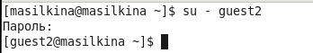

---
# Front matter
title: "Лабораторная работа №3."
subtitle: "Дискреционное разграничение прав в Linux. Два пользователя"
author: "Силкина Мария Александровна"

# Formatting
toc-title: "Содержание"
toc: true # Table of contents
toc_depth: 2
lof: true # List of figures
lot: true # List of tables
fontsize: 12pt
linestretch: 1.5
papersize: a4paper
documentclass: scrreprt
polyglossia-lang: russian
polyglossia-otherlangs: english
mainfont: PT Serif
romanfont: PT Serif
sansfont: PT Sans
monofont: PT Mono
mainfontoptions: Ligatures=TeX
romanfontoptions: Ligatures=TeX
sansfontoptions: Ligatures=TeX,Scale=MatchLowercase
monofontoptions: Scale=MatchLowercase
indent: true
pdf-engine: lualatex
header-includes:
  - \linepenalty=10 # the penalty added to the badness of each line within a paragraph (no associated penalty node) Increasing the value makes tex try to have fewer lines in the paragraph.
  - \interlinepenalty=0 # value of the penalty (node) added after each line of a paragraph.
  - \hyphenpenalty=50 # the penalty for line breaking at an automatically inserted hyphen
  - \exhyphenpenalty=50 # the penalty for line breaking at an explicit hyphen
  - \binoppenalty=700 # the penalty for breaking a line at a binary operator
  - \relpenalty=500 # the penalty for breaking a line at a relation
  - \clubpenalty=150 # extra penalty for breaking after first line of a paragraph
  - \widowpenalty=150 # extra penalty for breaking before last line of a paragraph
  - \displaywidowpenalty=50 # extra penalty for breaking before last line before a display math
  - \brokenpenalty=100 # extra penalty for page breaking after a hyphenated line
  - \predisplaypenalty=10000 # penalty for breaking before a display
  - \postdisplaypenalty=0 # penalty for breaking after a display
  - \floatingpenalty = 20000 # penalty for splitting an insertion (can only be split footnote in standard LaTeX)
  - \raggedbottom # or \flushbottom
  - \usepackage{float} # keep figures where there are in the text
  - \floatplacement{figure}{H} # keep figures where there are in the text
---

# Цель работы

Получение практических навыков работы в консоли с атрибутами файлов для групп пользователей.

# Задачи

1. Выполнить последовательно лабораторную работу по заданному алгоритму.

2. Ознакомиться с атрибутами и правами и заполнить таблицы из лабораторной.

# Выполнение лабораторной работы 

Первым шагом я создала новую учетную запись guest и guest2, создала пароль для guest2 и добавила guest 2 в группу guest (рис 1. -@fig:001).

{ #fig:001 width=70% }

Далее вошла через две вкладки терминала в эти учетные записи (рис 2. -@fig:002) (рис 3. -@fig:003). 

{ #fig:002 width=70% }

{ #fig:003 width=70% }

Определила командами groups guest и groups guest2, в какие группы входят пользователи guest и guest2. Сравнила вывод команды groups с выводом команд id -Gn и id -G.(рис 4. -@fig:004)(рис 5. -@fig:004).

{ #fig:004 width=70% }

{ #fig:005 width=70% }

От имени пользователя guest изменила права директории /home/guest, разрешив все действия для пользователей группы. От имени пользователя guest сняла с директории /home/guest/dir1 все атрибуты (рис 6. -@fig:006)

{ #fig:006 width=70% }

Далее я составила таблицы в которых заполнила какие действия возможны при определенных правах на файл/директорию (таб. 1).

|Права директории|Права файла|Создание файла|Удаление файла|Запись в файл|Чтение файла|Смена директории|Просмотр файлов в директории|Переименование файла|Смена атрибутов файла|
|----------------|-----------|--------------|--------------|-------------|------------|----------------|----------------------------|--------------------|---------------------|
|d(000)          |(000)      |-             |-             |-            |-           |-               |-                           |-                   |-                    |
|d(000)          |(010)      |-             |-             |-            |-           |-               |-                           |-                   |-                    |
|d(000)          |(020)      |-             |-             |-            |-           |-               |-                           |-                   |-                    |
|d(000)          |(030)      |-             |-             |-            |-           |-               |-                           |-                   |-                    |
|d(000)          |(040)      |-             |-             |-            |-           |-               |-                           |-                   |-                    |
|d(000)          |(050)      |-             |-             |-            |-           |-               |-                           |-                   |-                    |
|d(000)          |(060)      |-             |-             |-            |-           |-               |-                           |-                   |-                    |
|d(000)          |(070)      |-             |-             |-            |-           |-               |-                           |-                   |-                    |
|d(010)          |(000)      |-             |-             |-            |-           |-               |-                           |-                   |-                    |
|d(010)          |(010)      |-             |-             |-            |-           |-               |-                           |-                   |-                    |
|d(010)          |(020)      |-             |-             |+            |-           |-               |-                           |-                   |-                    |
|d(010)          |(030)      |-             |-             |+            |-           |-               |-                           |-                   |-                    |
|d(010)          |(040)      |-             |-             |-            |+           |-               |-                           |-                   |-                    |
|d(010)          |(050)      |-             |-             |-            |+           |-               |-                           |-                   |-                    |
|d(010)          |(060)      |-             |-             |+            |+           |-               |-                           |-                   |-                    |
|d(100)          |(070)      |-             |-             |+            |+           |-               |-                           |-                   |-                    |
|d(020)          |(000)      |-             |-             |-            |-           |-               |-                           |-                   |-                    |
|d(020)          |(010)      |-             |-             |-            |-           |-               |-                           |-                   |-                    |
|d(020)          |(020)      |-             |-             |-            |-           |-               |-                           |-                   |-                    |
|d(020)          |(030)      |-             |-             |-            |-           |-               |-                           |-                   |-                    |
|d(020)          |(040)      |-             |-             |-            |-           |-               |-                           |-                   |-                    |
|d(020)          |(050)      |-             |-             |-            |-           |-               |-                           |-                   |-                    |
|d(020)          |(060)      |-             |-             |-            |-           |-               |-                           |-                   |-                    |
|d(020)          |(070)      |-             |-             |-            |-           |-               |-                           |-                   |-                    |
|d(030)          |(000)      |+             |+             |-            |-           |+               |-                           |+                   |+                    |
|d(030)          |(010)      |+             |+             |-            |-           |+               |-                           |+                   |+                    |
|d(030)          |(020)      |+             |+             |-            |-           |+               |-                           |+                   |+                    |
|d(030)          |(030)      |+             |+             |-            |-           |+               |-                           |+                   |+                    |
|d(030)          |(040)      |+             |+             |-            |-           |+               |-                           |+                   |+                    |
|d(030)          |(050)      |+             |+             |-            |-           |+               |-                           |+                   |+                    |
|d(030)          |(060)      |+             |+             |-            |-           |+               |-                           |+                   |+                    |
|d(030)          |(070)      |+             |+             |-            |-           |+               |-                           |+                   |+                    |
|d(040)          |(000)      |-             |-             |-            |-           |-               |+                           |-                   |-                    |
|d(040)          |(010)      |-             |-             |-            |-           |-               |+                           |-                   |-                    |
|d(040)          |(020)      |-             |-             |-            |-           |-               |+                           |-                   |-                    |
|d(040)          |(030)      |-             |-             |-            |-           |-               |+                           |-                   |-                    |
|d(040)          |(040)      |-             |-             |-            |-           |-               |+                           |-                   |-                    |
|d(040)          |(050)      |-             |-             |-            |-           |-               |+                           |-                   |-                    |
|d(040)          |(060)      |-             |-             |-            |-           |-               |+                           |-                   |-                    |
|d(040)          |(070)      |-             |-             |-            |-           |-               |+                           |-                   |-                    |
|d(050)          |(000)      |-             |-             |-            |-           |-               |+                           |-                   |-                    |
|d(050)          |(010)      |-             |-             |-            |-           |-               |+                           |-                   |-                    |
|d(050)          |(020)      |-             |-             |+            |-           |-               |+                           |-                   |-                    |
|d(050)          |(030)      |-             |-             |+            |-           |-               |+                           |-                   |-                    |
|d(050)          |(040)      |-             |-             |-            |+           |-               |+                           |-                   |-                    |
|d(050)          |(050)      |-             |-             |-            |+           |-               |+                           |-                   |-                    |
|d(050)          |(060)      |-             |-             |+            |+           |-               |+                           |-                   |-                    |
|d(050)          |(070)      |-             |-             |+            |+           |-               |+                           |-                   |-                    |
|d(060)          |(000)      |-             |-             |-            |-           |-               |+                           |-                   |-                    |
|d(060)          |(010)      |-             |-             |-            |-           |-               |+                           |-                   |-                    |
|d(060)          |(020)      |-             |-             |-            |-           |-               |+                           |-                   |-                    |
|d(060)          |(030)      |-             |-             |-            |-           |-               |+                           |-                   |-                    |
|d(060)          |(040)      |-             |-             |-            |-           |-               |+                           |-                   |-                    |
|d(060)          |(050)      |-             |-             |-            |-           |-               |+                           |-                   |-                    |
|d(060)          |(060)      |-             |-             |-            |-           |-               |+                           |-                   |-                    |
|d(060)          |(070)      |-             |-             |-            |-           |-               |+                           |-                   |-                    |
|d(070)          |(000)      |+             |+             |-            |-           |+               |+                           |+                   |+                    |
|d(070)          |(010)      |+             |+             |-            |-           |+               |+                           |+                   |+                    |
|d(070)          |(020)      |+             |+             |-            |-           |+               |+                           |+                   |+                    |
|d(070)          |(030)      |+             |+             |-            |-           |+               |+                           |+                   |+                    |
|d(070)          |(040)      |+             |+             |-            |-           |+               |+                           |+                   |+                    |
|d(070)          |(050)      |+             |+             |-            |-           |+               |+                           |+                   |+                    |
|d(070)          |(060)      |+             |+             |-            |-           |+               |+                           |+                   |+                    |
|d(070)          |(070)      |+             |+             |-            |-           |+               |+                           |+                   |+                    |

: Установленные права и разрешённые действия

Далее создала таблицу, в которой обозначила минимальные права на действие (таб.2)

|Операция              |min права на директорию|min права на файл|
|----------------------|-----------------------|-----------------|
|Создание файла        |(- w x)                |(- - -)          |
|Удаление файла        |(- w x)                |(- - -)          |
|Чтение файла          |(- - x)                |(r - -)          |
|Запись в файл         |(- - x)                |(- w -)          |
|Переименование файла  |(- w x)                |(- - -)          |
|Создание поддиректории|(- w x)                |(- - -)          |
|Удаление поддиректории|(- w x / r-x)          |(- - -)          |

: Минимальные права для совершения операций

# Выводы

При выполнении данной лабораторной работы я получила практические навыки работы в консоли с атрибутами файлов для групп пользователей.

# Библиография

1. Кулябов Д. С., Королькова А. В., Геворкян М. Н. Информационная безопасность компьютерных сетей. Лабораторная работа № 3. Дискреционное разграничение прав в Linux. Два пользователя